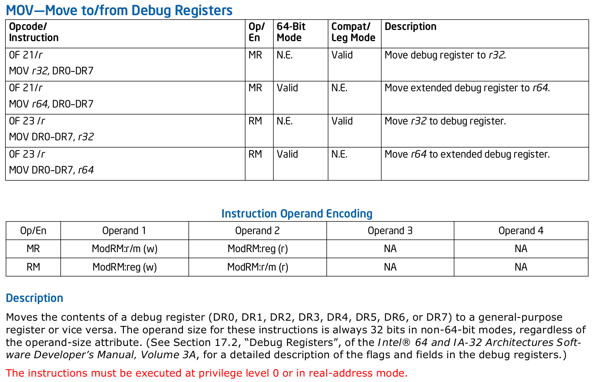

% Dans les entrailles d'un débogueur
% Camille Oudot (SOFT/LANNION)

# Un programme simple

## hello\_world.c

```c
int main(int argc, char *argv[]) {
    print_letter('H');
    print_letter('e');
    print_letter('l');
    print_letter('l');
    print_letter('o');
    ...
    print_letter(' ');
    print_letter('i');
    print_letter('s'); /* line 41 */
    print_letter(' '); /* line 42 */
    print_letter('n'); /* line 43 */
	...
}
```

- - -

```
$ gcc -g hello_world.c -no-pie -o hello
$ ./hello

Hello Dev Days 2018.
Debugging is not that hard...
```


# Interrompre hello\_world.c à la ligne 42

- - -

```
$ gdb hello

(gdb)


```

- - -

```
$ gdb hello

(gdb) break hello_world.c:42
Breakpoint 1 at 0x400721: file hello_world.c, line 42.

(gdb)


```
- - -

```
$ gdb hello

(gdb) break hello_world.c:42
Breakpoint 1 at 0x400721: file hello_world.c, line 42.

(gdb) run
    Hello Dev Days 2018.
    Debugging is
Breakpoint 1, main (...) at hello_world.c:42

(gdb)


```
- - -

```
$ gdb hello

(gdb) break hello_world.c:42
Breakpoint 1 at 0x400721: file hello_world.c, line 42.

(gdb) run
    Hello Dev Days 2018.
    Debugging is
Breakpoint 1, main (...) at hello_world.c:42

(gdb) continue
Continuing.
     not that hard...
[Inferior 1 (process 24925) exited normally]
```

# Comment ça marche ?

- - -

> **Hardware breakpoints** are sometimes available as a built-in debugging
> features with some chips.

> Typically these work by having **dedicated register** into which the breakpoint
> address may be stored. If the PC (shorthand for **program counter**) ever matches
> a value in a breakpoint registers, the CPU **raises an exception** and **reports it
> to GDB**.

> -- [**GDB wiki**](https://sourceware.org/gdb/wiki/Internals/Breakpoint%20Handling)

# Points d'arrêt matériels

## Registres de débogage `x86` 


## Lecture et écriture des registres de débogage



## [linux/arch/x86/include/asm/debugreg.h](https://git.kernel.org/pub/scm/linux/kernel/git/torvalds/linux.git/tree/arch/x86/include/asm/debugreg.h#n50)

```c
static inline void native_set_debugreg(int regno, unsigned long value)
{
	switch (regno) {
	case 0:
		asm("mov %0, %%db0"	::"r" (value));
		break;
	...
	case 7:
		asm("mov %0, %%db7"	::"r" (value));
		break;
	default:
		BUG();
	}
}
```

## [binutils-gdb/gdb/nat/x86-linux-dregs.c](https://sourceware.org/git/gitweb.cgi?p=binutils-gdb.git;a=blob;f=gdb/nat/x86-linux-dregs.c;h=5437fb406afd7aae660ccdd4c1e2bc7f88c07284;hb=HEAD#l57)

```c
/* Set debug register REGNUM to VALUE in the LWP specified by PTID. */
static void
x86_linux_dr_set (ptid_t ptid, int regnum, unsigned long value)
{
  int tid;
  ...
  tid = ptid.lwp ();

  ptrace (PTRACE_POKEUSER, tid, u_debugreg_offset (regnum), value);
  ...
}
```

# Points d'arrêt logiciels

- - -

> Since _hardware breakpoints_ depend on hardware resources, they may be
> limited in number; when the user asks for more, GDB will start trying to set
> **software breakpoints**.

> The basic theory is that GDB will **replace a program instruction** with some
> instruction that will **cause an exception**, and then when it’s encountered,
> GDB will **take the exception** and stop the program.  When the user says to
> continue, GDB will **restore the original instruction**.

> -- [**GDB wiki**](https://sourceware.org/gdb/wiki/Internals/Breakpoint%20Handling)

## Problèmes à résoudre

- remplacer une instruction
	- accéder à l'espace mémoire du processus tracé depuis le débogueur
	- trouver l'adresse où se trouve l'instruction à remplacer
	- causer une exception dans le processus tracé
- capturer l'exception et continuer le processus tracé

# Accéder à l'espace mémoire du processus tracé

## Isolation mémoire


## L'appel système `ptrace()`

- introduit en 1975 dans _Version 6 Unix_
- permet à un processus parent de contrôler l'exécution d'un processus enfant
	- **`PTRACE_PEEKDATA`**, **`PTRACE_POKEDATA`** : lire et écrire dans son espace mémoire
	- **`PTRACE_PEEKUSER`**, **`PTRACE_POKEUSER`** : lire et écrire dans la structure
	  du noyau représentant le processus (y compris la sauvegarde des valeurs
	  des registres)

### `man 2 ptrace`
```c
#include <sys/ptrace.h>

long ptrace(enum __ptrace_request request, pid_t pid,
				  void *addr, void *data);
```

## /proc/PID/mem

Méthode plus récente et plus pratique pour lire/écrire dans l'espace mémoire d'un processus :

```c
void peek_mem(pid_t pid, void *address, unsigned char *buf, size_t len)
{
	char name[32];
	sprintf(name, "/proc/%d/mem", pid);
	int memfd = open(name, O_RDONLY);
	lseek64(memfd, (off64_t)address, SEEK_CUR);
	read(memfd, buf, len);
	close(memfd);
}

void poke_mem(pid_t pid, void *address, unsigned char *buf, size_t len)

```

# Trouver l'adresse de l'instruction de la ligne 42

## Plan mémoire


- - -

```
$ cat /proc/$(pidof hello)/maps

< address range   perm. offset  dev.  inode    path >
00400000-00401000 r-xp 00000000 fd:01 37227078 hello
00600000-00601000 r--p 00000000 fd:01 37227078 hello
00601000-00602000 rw-p 00001000 fd:01 37227078 hello
01232000-01253000 rw-p 00000000 00:00 0        [heap]
(...)a81000-(...) r-xp 00000000 fd:00 2887009  /lib/libc-2.24.so
(...)c16000-(...) ---p 00195000 fd:00 2887009  /lib/libc-2.24.so
(...)e16000-(...) r--p 00195000 fd:00 2887009  /lib/libc-2.24.so
(...)e1a000-(...) rw-p 00199000 fd:00 2887009  /lib/libc-2.24.so
(...)e1c000-(...) rw-p 00000000 00:00 0 
      ...
(...)278000-(...) rw-p 00000000 00:00 0        [stack]
(...)317000-(...) r--p 00000000 00:00 0        [vvar]
(...)319000-(...) r-xp 00000000 00:00 0        [vdso]
ffffff(...)-(...) r-xp 00000000 00:00 0        [vsyscall]
```

## Que contient vraiment le fichier exécutable `hello` ?

```
$ file hello
hello: ELF 64-bit LSB executable, x86-64, version 1 (SYSV) (...)

$ readelf -S hello
En-têtes de section :
  [Nr] Nom               Type             Adresse           Décalage
       Taille            TaillEntrée      Fanion Lien  Info  Alignement
  [13] .text             PROGBITS         0000000000400490  00000490
       0000000000000402  0000000000000000  AX       0     0     16
  [24] .data             PROGBITS         0000000000601028  00001028
       0000000000000010  0000000000000000  WA       0     0     8
  [30] .debug_line       PROGBITS         0000000000000000  00001523
       0000000000000114  0000000000000000           0     0     1
```

<!--
## Que contient la section `.debug_line` ?

```
bash$ readelf -x .debug_line hello
Hex dump of section '.debug_line':
  0x00000000 10010000 0200ba00 00000101 fb0e0d00 ................
  0x00000010 01010101 00000001 0000012f 7573722f .........../usr/
  0x00000020 6c69622f 6763632f 7838365f 36342d6c lib/gcc/x86_64-l
    (...)
  0x00000090 00747970 65732e68 00020000 6c696269 .types.h....libi
  0x000000a0 6f2e6800 03000073 7464696f 2e680003 o.h....stdio.h..
  0x000000b0 00007379 735f6572 726c6973 742e6800 ..sys_errlist.h.
  0x000000c0 02000000 00090286 05400000 00000016 .........@......
  0x000000d0 e5089f08 ca9f9f9f 9f9f9f9f 9f9f9f9f ................
  0x000000e0 9f9f9f9f 9f9f9f9f 9f9f9f9f 9f9f9f9f ................
  0x000000f0 9f9f9f9f 9f9f9f9f 9f9f9f9f 9f9f9f9f ................
  0x00000100 9f9f9f9f 9f9f9f9f 08a05930 c9086702 ..........Y0..g.
  0x00000110 03000101                            ....
```
-->

## [DWARF Debugging Format Standard version 2.0](http://www.dwarfstd.org/doc/dwarf-2.0.0.pdf)

_**If space were not a consideration**, the information provided in the
`.debug_line` section could be represented as a large matrix, with one row for
each instruction in the emitted object code.  The matrix would have columns
for:_

- _the source file name_
- _the source line number_
- _the source column number_
- _whether this instruction is the beginning of a source statement_
- _whether this instruction is the beginning of a basic block._

_Such a matrix, however, **would be impractically large**. We shrink it with two
techniques. First, we delete from the matrix each row whose file, line and
source column information is identical with that of its predecessors. Second,
we design a byte-coded language for a **state machine** and store a stream of
bytes in the object file instead of the matrix. This language can be much more
compact than the matrix._

## Décoder la section `.debug_line`

```
$ readelf --debug-dump=line hello
 Line Number Statements:
  [0x000000c4]  set Address to 0x400586
  [0x000000cf]  advance Address by 0 to 0x400586 and Line by 4 to 5
  [0x000000d0]  advance Address by 15 to 0x400595 and Line by 1 to 6
  [0x000000d1]  Advance PC by constant 17 to 0x4005a6
    (...)
  [0x000000f4]  advance Address by 10 to 0x4006f3 and Line by 1 to 41
  [0x000000f5]  advance Address by 10 to 0x4006fd and Line by 1 to 42
  [0x000000f6]  advance Address by 10 to 0x400707 and Line by 1 to 43
    (...)
  [0x00000111]  Extended opcode 1: End of Sequence
```

L'adresse de l'instruction correspondant à la ligne 42 est **`0x4006fd`**

# Causer une exception dans le processus tracé

- - -

- division par zéro 
```asm
mov $0, %rdi
div %rdi ;divise %rdx:%rax par %rdi
```

- erreur de segmentation
```asm
mov $42, ($0) ;l'adresse 0x0 n'est pas mappée
mov $42, ($0x400400) ;l'adresse 0x400400 est protégée en écriture
```

- _erreur d'alignement (désactivé sur x86)_
```asm
movq ($0x400401), %rdi ;l'adresse 0x400401 n'est pas multiple de 8
```

- code invalide
```asm
ud2 ;opcode réservé à cet effet
```

- interruption logicielle
```asm
int $0x80
int3 ;équivalent à `int $3`
```

- - -


## Exemple

```c
const unsigned char int3 = 0xcc;
unsigned char breakpoint_backup;

void insert_breakpoint(pid_t tracee, void *address) {
	peek_mem(tracee, address, &breakpoint_backup, 1);
	poke_mem(tracee, address, &int3, 1);
}

void remove_breakpoint(pid_t tracee, void *address) {
	poke_mem(tracee, address, &breakpoint_backup, 1);
}
```

# Capturer l'exception et continuer le processus tracé

## L'appel système `wait()`

- également présent en 1975 dans _Version 6 Unix_
- permet à un processus parent d'attendre un évènement venant d'un enfant
	- il est terminé
	- il a été interrompu par un signal
	- il a été continué par un signal

### `man 2 wait`
```c
#include <sys/types.h>
#include <sys/wait.h>

pid_t wait(int *wstatus);
pid_t waitpid(pid_t pid, int *wstatus, int options);
```

## Attendre un signal

```c
int wait_for_signal(pid_t pid, int sig, int *wstatus) {
	if (waitpid(pid, wstatus, 0) > 0) {
		if (WIFSTOPPED(*wstatus) && WSTOPSIG(*wstatus) == sig) {
			return 1;
		}
	}
	return 0;
}
```

## Récupérer les infos sur l'exception

```c
enum tracee_status handle_tracee_signal(pid_t tracee, int sig) {
	if (sig == SIGTRAP) {
		siginfo_t si;
		ptrace(PTRACE_GETSIGINFO, tracee, NULL, &si);
		if (si.si_code == SI_KERNEL
				&& (void*)get_rip(tracee) == break_address + 1) {
			return reached_breakpoint;
		}
	}
	return received_not_handled_signal;
}
``` 

## Continuer le processus après le breakpoint

```c
void set_rip(pid_t pid, void *rip) {
	struct user_regs_struct regs;
	ptrace(PTRACE_GETREGS, pid, NULL, regs );
	regs.rip = (unsigned long long)rip;
	ptrace(PTRACE_SETREGS, pid, NULL, regs );
}

set_rip(tracee, break_address);
remove_breakpoint(tracee, break_address);
ptrace(PTRACE_CONT, tracee, NULL, NULL);
```

- - -


- - -


